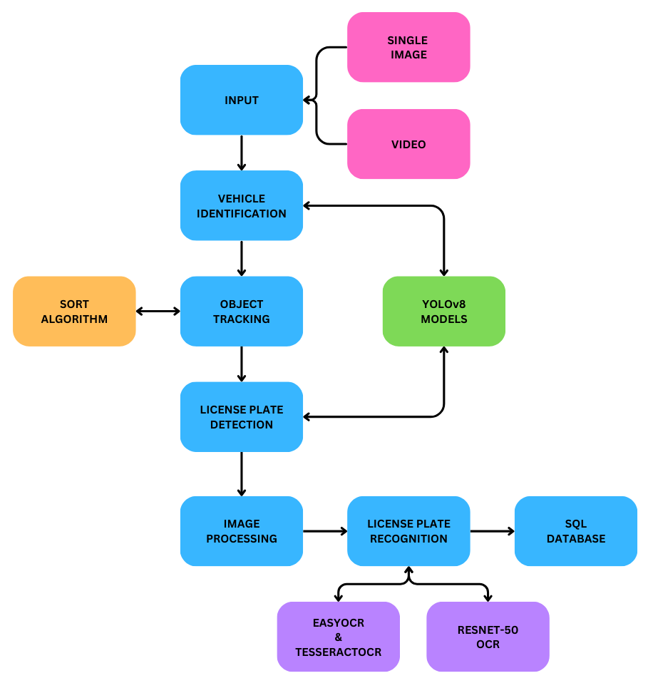

# Vehicle Movement Analysis and Insight Generation in a College Campus using Edge AI

## Introduction

This project aims to analyze vehicle movement and parking within a college campus to enhance security and management. The solution captures vehicle images, recognizes license plates, and matches them to an approved vehicle database to identify unauthorized vehicles.

## Table of Contents

- [Dataset Description](#dataset-description)
- [Methodology](#methodology)
  - [Input Method](#input-method)
  - [YOLOv8](#yolov8)
  - [Object Tracking with SORT Algorithm](#object-tracking-with-sort-algorithm)
  - [Image Processing Operations](#image-processing-operations)
  - [License Plate Recognition](#license-plate-recognition)
- [SQL Database Integration](#sql-database-integration)
- [Installation](#installation)
- [Usage](#usage)
- [License](#license)

## Dataset Description

### Number Plate Detection Model Dataset

- **Total Images**: 1300
- **Training Set**: 1000 images (resized to 720x720 pixels)
- **Testing Set**: 300 images

### Character Recognition Model (ResNet-50) Dataset

- **Total Images**: 36576 images of individual characters (A-Z, a-z, 0-9)
- **Training Set**: 29261 images
- **Testing Set**: 7315 images
- **Image Size**: 128x128 pixels

## Methodology



### Input Method

- **Image Input**: Preprocessed single image passed through YOLOv8 for vehicle detection and ResNet-50, secondary OCRs for license plate recognition.
- **Video Input**: Each frame is treated as an individual image and processed using YOLOv8, ResNet-50 and secondary OCRs.

### YOLOv8

- **Vehicle Identification**: Pre-trained YOLOv8 model.
- **License Plate Detection**: Custom-trained YOLOv8 model.

### Object Tracking with SORT Algorithm

- **Initialization and Setup**: Configured to handle bounding boxes from YOLOv8.
- **Tracking Process**: Utilizes a Kalman filter and Hungarian algorithm-based method.
- **Unique Identification**: Each vehicle is assigned a unique hash ID.

### Image Processing Operations

- **Image Resizing**: Standardized to (1000, 350) pixels.
- **Gaussian Blurring and Thresholding**: Noise reduction and edge enhancement.
- **Connected Components Analysis**: Character segmentation.
- **Bounding Box Extraction**: Precise character localization.

### License Plate Recognition

- **ResNet-50 OCR**: For character recognition.
- **Secondary OCR**: EasyOCR and TesseractOCR for alternative results.

## SQL Database Integration

- **Tables**:
  - `readings`: Stores vehicle detection details and confidence scores.
  - `tags`: Contains tags like "Staff" or "Visitor".
  - `anpr`: Logs ANPR events with license plate and state information.
- **Data Insertion Logic**: Updates or inserts data based on confidence scores and vehicle detection.

- **Features**:
  - MySQL integration for CRUD operations.
  - HTTP request handling and static file serving.
  - Route handling for managing ANPR data.

## Installation

1. Clone the repository:
   ```bash
   git clone https://github.com/BlackReaper0/ANPR-Research-Work.git
   cd ANPR-Research-Work
   ```
2. Create a Python Virtual Environment:
   ```bash
   python -m venv environment_name
   ```
3. Activate the virtual environment:
   ```bash
   .\environment_name\Scripts\activate
   ```
4. Install the required Python packages:

   ```bash
   pip install -r requirements.txt
   ```

5. Now Setup a Database and Create the required Tables according to the give schema:

6. Change the Database Credentials in connection.js and in the main.py files.

## Usage

1. Run the python scripts for ANPR system:
   ```bash
   python .\main_image.py
   ```
